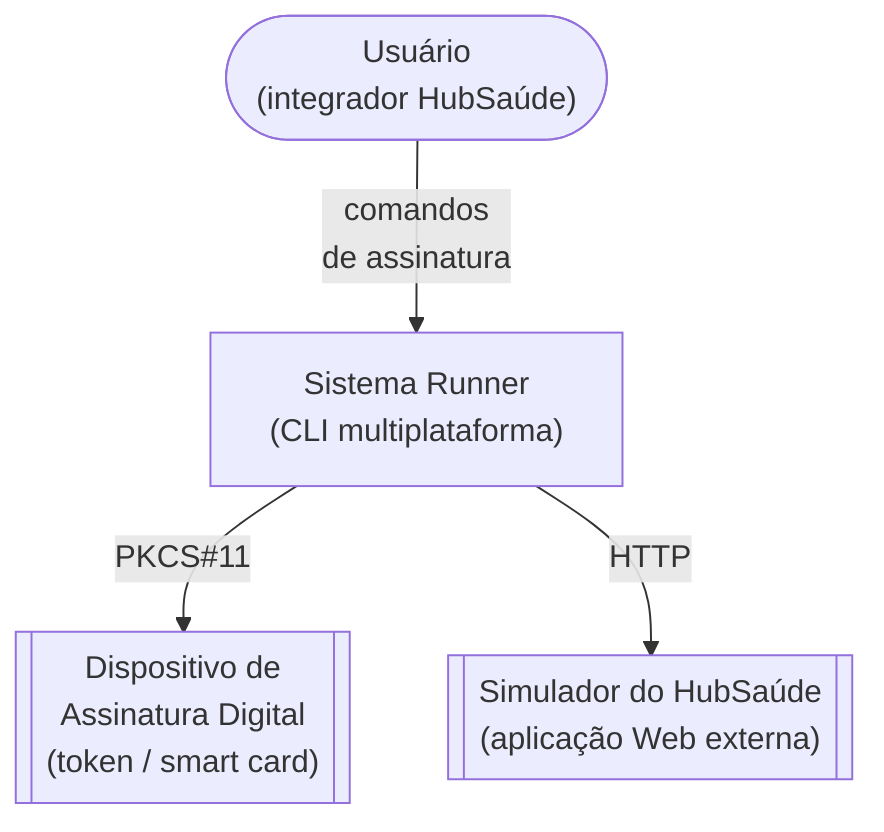
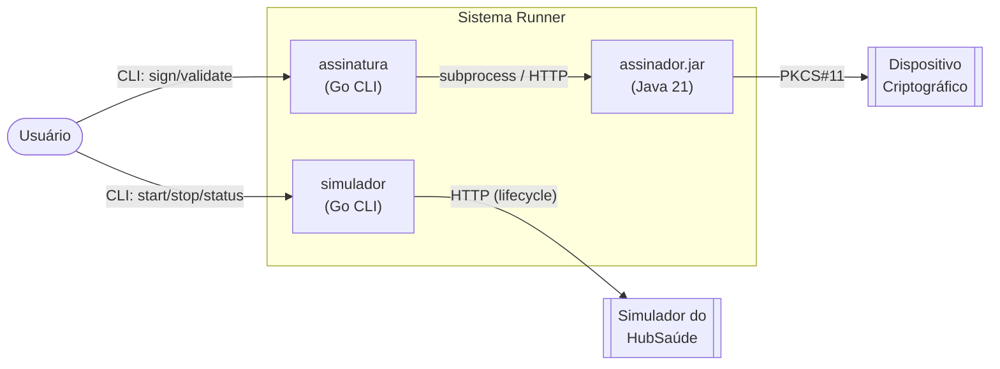
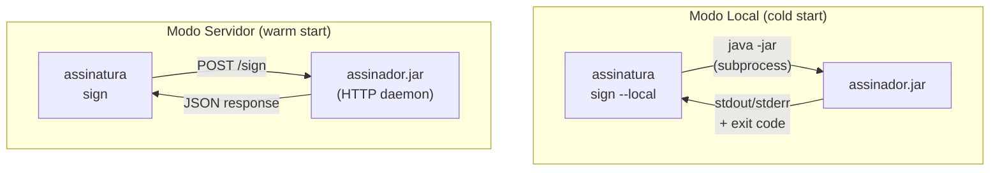

# Sistema Runner — Design

Este documento descreve a arquitetura do Sistema Runner usando o
[modelo C4](https://c4model.com/). Os diagramas são renderizados pelo GitHub
usando [Mermaid](https://mermaid.js.org/).

> Diagramas fonte em PlantUML (.puml) e versões SVG renderizadas serão
> publicados em [`docs/diagramas/`](diagramas/) conforme a Semana 9 do
> [planejamento semanal](../../planejamento-semanal.md).

## 1. Diagrama de Contexto (C4 Nível 1)

Mostra os atores, sistemas externos e o Sistema Runner como uma caixa única.

**Atores e sistemas externos:**

| Elemento | Tipo | Descrição |
|----------|------|-----------|
| Usuário | Ator | Pessoa que interage com o sistema via linha de comandos |
| Dispositivo de Assinatura Digital | Sistema Externo | Hardware criptográfico (token USB, smart card) que armazena certificados e executa operações de assinatura |
| Simulador do HubSaúde | Sistema Externo | Aplicação Web gerida pelo CLI e que responde a requisições de terceiros |

## 2. Diagrama de Contêineres (C4 Nível 2)

Decompõe o Sistema Runner em suas três aplicações.

**Comunicação entre contêineres:**

| Origem | Destino | Protocolo | Descrição |
|--------|---------|-----------|-----------|
| Usuário | assinatura | CLI | Comandos de assinatura (criar, validar) |
| Usuário | simulador | CLI | Comandos de gerenciamento do simulador |
| assinatura | assinador.jar | subprocess OU HTTP | Invocação direta ou requisição HTTP, conforme modo |
| assinador.jar | Dispositivo Criptográfico | PKCS#11 | Interface padrão para tokens e smart cards |
| simulador | Simulador do HubSaúde | HTTP | Invoca e monitora o ciclo de vida do simulador |

## 3. Modos de invocação do assinador.jar

A interação `assinatura → assinador.jar` ocorre em um de dois modos,
escolhidos pelo usuário via flags (`--local` ou padrão servidor):

- **Local** (US-01.3): cada execução faz cold-start da JVM. Adequado para
  scripts esporádicos.
- **Servidor** (US-02.4, US-01.5..9): JAR permanece em execução; chamadas
  subsequentes são warm-start (latência baixa).
